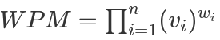
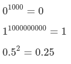

# Free Yourself from Indecision with Weighted Product Models
## How companies and crazy data scientists use [Decision Analysis](https://www.investopedia.com/terms/d/decision-analysis.asp) to choose things

As a friendly Data Scientist, coworkers always come to me with interesting problems to get some help. People ask me to create a model, a formula, a chart, something...to solve some quantitative problem.

In the past six months, a recurring problem appeared for different people: how to decide on the best project/campaign/item/apartment, among many alternatives, if you have to evaluate a lot of criteria?

People may think I pick, without hesitation, some amazing Artificial Intelligence algorithm, a Deep Learning classifier, or even a Hill-climbing Ensemble Selection with Bootstrap Sampling. However, as Robert Browning said, ["Well, less is more, Lucrezia"](https://www.poetryfoundation.org/poems/43745/andrea-del-sarto).

A [Weighted Product Model](https://www.wikiwand.com/en/Weighted_product_model) (WPM) is a simple and popular technique to solve Multi-Criteria Decision Analysis problems. It basically consists of multiply all attributes values to get a score. The higher, the better.

As an example, look at the following table:

|Projects / Features|A|B|C|D|
|--|--|--|--|--|
|Project 1|30|17|5|20|
|Project 2|27|8|14|10|
|Project 3|8|25|13|36|

The WPM score for the first line is:

Project 1 = 30 x 17 x 5 x 20 = 51,000

A more formal definition is:



where:

- *i* : index
- *n* : number of features
- *v<sub>i</sub>* : value of the i-th feature
- *w<sub>i</sub>* : weight of the i-th feature


Thus, using the score provided by the WPM, the preferences are ranked like this

|Projects / Features|A|B|C|D|WPM
|--|--|--|--|--|--|
|Project 3|8|25|13|36|93,600|
|Project 1|30|17|5|20|51,000|
|Project 2|27|8|14|10|30,240|

if the weights are the same for each feature (*w<sub>i</sub> = 1*).

## A Real Life Problem

Weight Product Model is a very easy technique. You may use any programming language or even a spreadsheet (get the code on [github](https://github.com/rnmourao/mcda-wpm)). 

To show how to do it in Python, let's take another example:

||beds|baths|area|hoa|parking|year|floor|exposure|elevator|price|
|---:|-------:|--------:|-------:|------:|----------:|-------:|--------:|:-----------|:-----------|--------:|
|0|1|1|700|230.00|0|1895|2|W|No|199,000|
|1|1|1|750|546.00|1|1951|4|W|Yes|185,000|
|2|1|1|985|424.00|1|1892|3|W|Yes|210,000|
|3|2|2|1200|973.00|1|1965|8|E|Yes|209,900|
|4|3|2|1600|150.00|0|2020|3|E|No|279,000|

The table above corresponds to apartments for sale in Chicago, IL, and the data was obtained from a popular real state web site. The features are the number of bedrooms (**beds**), number of bathrooms (**baths**), total **area**, homeowners association fee (**hoa**), number of **parking** spaces, **year** of the building, apartment's **floor**, **exposure** to the sun, the existence of **elevator**, and **price**.

Despite its simplicity, there are some pitfalls. First I'll show you how to do it right, then I'll show you what you shouldn't do.

Let's import some libraries:

```{python}
import pandas as pd
from sklearn.preprocessing import MinMaxScaler
```
Then, I create a pandas DataFrame:

```{python}
raw = pd.read_csv('apartments.csv')
```

WPM uses only numerical features. So, I convert *exposure* and *elevator* to numeric:

```{python}
# keep original data safe
df = raw.copy()

# now exposure to West and to East are, respectively, 0 and 1
df['exposure'] = df.apply(lambda r: 1 if r['exposure'] == 'E' else 0, axis=1)

# if an building has an elevator, it will receive 1; 0 otherwise
df['elevator'] = df.apply(lambda r: 1 if r['elevator'] == 'Yes' else 0, axis=1)
```

Now, the table looks like this:

||beds|baths|area|hoa|parking|year|floor|exposure|elevator|price|
|---:|-------:|--------:|-------:|------:|----------:|-------:|--------:|-----------:|-----------:|--------:|
|0|1|1|700|230.00|0|1895|2|0|0|199,000|
|1|1|1|750|546.00|1|1951|4|0|1|185,000|
|2|1|1|985|424.00|1|1892|3|0|1|210,000|
|3|2|2|1200|973.00|1|1965|8|1|1|209,900|
|4|3|2|1600|150.00|0|2020|3|1|0|279,000|

Next, I scale all features to same range:

```{python}
# create a scaler with range [10, 100]
mms = MinMaxScaler(feature_range=(10, 100)) 

# apply scaler
df = pd.DataFrame(mms.fit_transform(df), columns=df.columns)
```

Now, every value is between 10 and 100.

||beds|baths|area|hoa|parking|year|floor|exposure|elevator|price|
|---:|-------:|--------:|-------:|---------:|----------:|---------:|--------:|-----------:|-----------:|---------:|
|0|10|10|10|18.7485|10|12.1094|10|10|10|23.4043|
|1|10|10|15|53.305|100|51.4844|40|10|100|10|
|2|10|10|38.5|39.9635|100|10|25|10|100|33.9362|
|3|55|100|60|100|100|61.3281|100|100|100|33.8404|
|4|100|100|100|10|10|100|25|100|10|100|

It's time to define the weights:

```{python}
weights = {'beds'          :  1.,
           'baths'         :  1.,
           'area'          :  1.,
           'hoa'           : -1.,
           'parking'       :  1.,
           'year'          :  1.,
           'floor'         : -1.,
           'price'         : -1.,
           'exposure'      :  1.,
           'elevator'      :  1.}
```

The idea here is to make negative the features aren't benefits. As instance, if the price goes up, the WPM Score should goes down.

Let's define the WPM function:

```{python}
def wpm(option, weights):
    # initial value
    value = 1

    # iterate over the features
    for column in option.keys():

        try:
            value *= option[column] ** weights[column]

        # a caution if some feature is forgotten
        except KeyError:
            pass

    return value
```

Then, we apply the function over the rows:

```{python}
df['wpm'] = df.apply(lambda r: wpm(r, weights), axis=1)

# merge the wpm score with the original table to a better interpretation of the results
pd.merge(raw, df['wpm'], left_index=True, right_index=True) \
  .sort_values(by='wpm', ascending=False)
```

||beds|baths|area|hoa|parking|year|floor|exposure|elevator|price|wpm|
|---:|-------:|--------:|-------:|------:|----------:|-------:|--------:|:-----------|:-----------|--------:|----------------:|
|3|2|2|1200|973.00|1|1965|8|E|Yes|209,900|5.9805e+07|
|4|3|2|1600|150.00|0|2020|3|E|No|279,000|4e+07|
|1|1|1|750|546.00|1|1951|4|W|Yes|185,000|362192|
|2|1|1|985|424.00|1|1892|3|W|Yes|210,000|113552|
|0|1|1|700|230.00|0|1895|2|W|No|199,000|2759.69|

The WPM Score ranked the apartments in a way all features are equally important. However, if an affordable HOA is more relevant than the number of bathrooms? Different features importances can be achieved by changes in their weights:

```{python}
weights = {'beds'          :  1.,
           'baths'         :  1.,
           'area'          :  3.,
           'hoa'           : -5.,
           'parking'       :  5.,
           'year'          :  1.,
           'floor'         : -5.,
           'price'         : -3.,
           'exposure'      :  1.,
           'elevator'      :  5.}
```
These weight values were purely arbitrary - and they usually depend on the judgment of the decision-maker. Also, it's possible to define a different scale. Here I used a [Likert Scale](https://www.wikiwand.com/en/Likert_scale) because it is very straightforward.

Parking space, elevator, cheap HOA, and low floor are now essential; area and price are considerable, and the rest is of little importance.

||beds|baths|area|hoa|parking|year|floor|exposure|elevator|price|wpm|
|---:|-------:|--------:|-------:|------:|----------:|-------:|--------:|:-----------|:-----------|--------:|-------------:|
|2|1|1|985|424.00|1|1892|3|W|Yes|210,000|1.46681e+09|
|1|1|1|750|546.00|1|1951|4|W|Yes|185,000|3.94285e+08|
|3|2|2|1200|973.00|1|1965|8|E|Yes|209,900|1.88005e+08|
|4|3|2|1600|150.00|0|2020|3|E|No|279,000|1.024e+06|
|0|1|1|700|230.00|0|1895|2|W|No|199,000|40.7762|

The WPM score now has an entirely different scale, but that doesn't matter, because only the ranking is relevant.

## Don'ts

As I said before, you need to take some precautions to use the WPM correctly. 

First of all, you NEED to scale the table. All features. Ever. People might say you don't need to do that because the data is already prepared or WPM itself doesn't need it. 

Second: don't scale the values to [0, 1] range. Prefer values bigger than that. Why? Because of the following power properties:



0 is almost always 0, 1 is always 1, and a fraction will become smaller if you apply a power greater than 1. So, choose another range.

Related to the weights, you can use any value. But again, keep it simple: use integers, negatives only when a feature is an onus, and beware with zero.

The third caution is a bit more complicated: the features should be reasonably independent. If there is a cause-and-effect relationship between two or more of them, you should keep only one. For example, just imagine you have a feature named [**property tax**](https://smartasset.com/taxes/illinois-property-tax-calculator), which its calculation strongly depends on the apartment's price:

||beds|baths|area|...|price|tax|
|---:|-------:|--------:|-------:|-------:|--------:|------:|
|0|1|1|700|...|199,000|4,213|
|1|1|1|750|...|185,000|3,916|
|2|1|1|985|...|210,000|4,446|
|3|2|2|1200|...|209,900|4,444|
|4|3|2|1600|...|279,000|5,906|

If you calculate the [Pearson's Correlation Coefficient](https://towardsdatascience.com/pearson-coefficient-of-correlation-explained-369991d93404) between these two features:

```{python}
df[['price', 'tax']].corr()
```

You will find a perfect correlation:

|       |   price |   tax |
|:------|--------:|------:|
| price |       1 |     1 |
| tax   |       1 |     1 |

If you add these two features, it's like you add the column **price** twice. Its weight will be doubled, making it two times more relevant. In other words, it will mess the weights.

However, a high value for Pearson's Correlation may be a clue, but [not a guarantee](https://www.wikiwand.com/en/Correlation_does_not_imply_causation) the two features are dependent. As an example of that, let's test two other features, **elevator** and **parking**:

```{python}
df[['elevator', 'parking']].corr()
```

|          |   elevator |   parking |
|:---------|-----------:|----------:|
| elevator |          1 |         1 |
| parking  |          1 |         1 |

These two features are highly correlated, but the existence of an elevator in the building does not imply the apartment will have a parking space!

So, you need to analyze the features to decide which of them you should discard.

## WPM is cool, but...

Decision analysis has many techniques and solves a lot of problems. If you are interested to learn more about it, feel free to follow the links I put at the end of this post. 

## References

1. [Multi-Criteria Decision Making: An Operations Research Approach](https://www.semanticscholar.org/paper/Multi-Criteria-Decision-Making%3A-An-Operations-Triantaphyllou-Shu/2742bc0516f28152472ee35ea400418e0bc69f7d). Triantaphyllou, E. et al. 1998.
2. [Add or Multiply? A Tutorial on Ranking and Choosing with Multiple Criteria](https://pubsonline.informs.org/doi/pdf/10.1287/ited.2013.0124l). Tofallis, C. 2013.
3. [Wikipedia](https://www.wikiwand.com/en/Multiple-criteria_decision_analysis).
4. [Journal of Multi-Criteria Decision Analysis](https://onlinelibrary.wiley.com/journal/10991360).